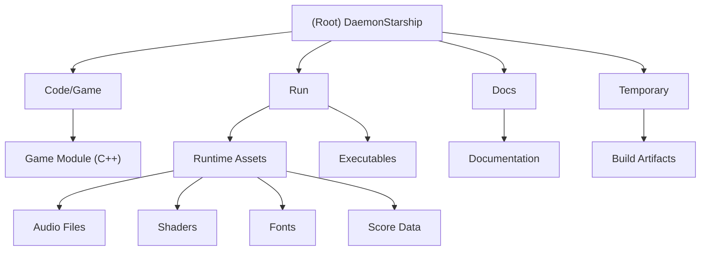

# DaemonStarship - Space Shooter Game

## Changelog

### 2025-09-25 17:43:22
- Initial AI context documentation created
- Project structure analysis and module identification completed
- Comprehensive game architecture documentation established

## Project Vision

DaemonStarship is a classic 2D space shooter game built in C++ using a custom game engine architecture. The game features a player-controlled starship defending against waves of enemies including asteroids, beetles, and wasps in an infinite space environment with scoreboard tracking and multiple game modes.

## Architecture Overview

The project follows a traditional game engine architecture with clear separation of concerns:
- **Application Layer**: Main entry point and application lifecycle management
- **Game Layer**: Core game logic, entity management, and gameplay mechanics  
- **Engine Integration**: Utilizes a custom C++ game engine (external dependency)
- **Rendering Pipeline**: DirectX 11 HLSL shader-based rendering system
- **Audio System**: FMOD-based audio playback for music and sound effects
- **Data Management**: File-based scoreboard persistence and asset loading

## Module Structure Diagram

## Module Index

| Module | Path | Language | Description |
|--------|------|----------|-------------|
| **Game** | `Code/Game/` | C++ | Main game implementation containing all gameplay logic, entities, UI, and scoreboard management |
| **Runtime** | `Run/` | Assets/Executables | Runtime directory containing game executables, asset files (audio, shaders, fonts), and persistent data |
| **Documentation** | `Docs/` | Markdown | Project documentation (currently contains template README) |

## Running and Development

### Prerequisites
- Visual Studio 2019/2022 with C++ development tools
- Windows 10/11 (x64)
- DirectX 11 compatible graphics card
- External Engine dependency (located in `../Engine/`)

### Building the Project
1. Open `DaemonStarship.sln` in Visual Studio
2. Ensure the Engine project dependency is available at `../Engine/Code/Engine/Engine.vcxproj`
3. Build solution in Debug or Release configuration
4. Executables are automatically copied to the `Run/` directory

### Running the Game
- Execute `DaemonStarship_Debug_x64.exe` or `DaemonStarship_Release_x64.exe` from the `Run/` directory
- Game data and assets are loaded from the `Run/Data/` subdirectories

## Testing Strategy

The project currently lacks formal unit tests but includes:
- **Debug Rendering**: Comprehensive debug visualization system for entity physics and collision detection
- **Developer Console**: In-game console for runtime debugging and parameter adjustment
- **Hot Reload System**: Dynamic code reloading capabilities during development
- **Multiple Build Configurations**: Debug and Release builds with different optimization levels

## Coding Standards

### Architecture Patterns
- **Entity-Component Model**: Base Entity class with derived game objects (PlayerShip, Bullet, Asteroid, etc.)
- **Fixed-Array Management**: Uses fixed-size arrays for entity pools to avoid dynamic allocation
- **Resource Management**: RAII-style resource cleanup with custom GAME_SAFE_RELEASE template
- **Event System**: Event-driven architecture for decoupled communication

### Naming Conventions
- **Classes**: PascalCase (e.g., `PlayerShip`, `ScoreBoardHandler`)
- **Member Variables**: m_ prefix with camelCase (e.g., `m_playerShip`, `m_isAttractMode`)
- **Constants**: ALL_CAPS with underscores (e.g., `MAX_BULLETS_NUM`, `WORLD_SIZE_X`)
- **Functions**: PascalCase for public methods, camelCase for private methods

### Code Quality
- Uses modern C++20 features
- Extensive use of const correctness
- Header-only templates for type safety
- Comprehensive inline documentation
- Platform-specific compilation with WIN32_LEAN_AND_MEAN

## AI Usage Guidelines

### Code Analysis Assistance
- **Entity Relationship Mapping**: AI can help visualize entity inheritance and interaction patterns
- **Performance Optimization**: Analysis of fixed-array usage vs dynamic allocation trade-offs
- **Memory Management**: Review of resource cleanup and potential memory leaks
- **Architecture Evolution**: Suggestions for modularization and component system improvements

### Development Support
- **Debug Feature Enhancement**: Expanding debug rendering and console command systems
- **Gameplay Balancing**: Analysis of game constants and difficulty progression
- **Code Refactoring**: Identifying opportunities for code organization improvements
- **Documentation Generation**: Automated API documentation from header files

### Code Modification Guidelines
- Preserve the existing entity architecture and fixed-array memory model
- Maintain compatibility with the external Engine dependency
- Follow established naming conventions and code organization patterns
- Ensure all changes maintain the real-time performance characteristics required for 60 FPS gameplay