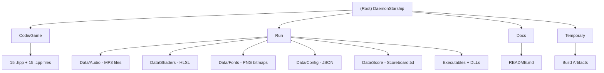

# DaemonStarship - Space Shooter Game

## Changelog

### 2026-02-14
- Updated all CLAUDE.md files with accurate project structure and codebase analysis
- Added V8 scripting engine and OpenSSL dependencies to documentation
- Created comprehensive Game module CLAUDE.md with full class hierarchy and constants
- Refined architecture overview, build configuration, and coding standards

### 2025-09-25 17:43:22
- Initial AI context documentation created
- Project structure analysis and module identification completed
- Comprehensive game architecture documentation established

## Project Vision

DaemonStarship is a classic 2D space shooter game built in C++20 using a custom game engine architecture. The game features a player-controlled starship defending against 5 waves of enemies (asteroids, beetles, and wasps) in a wraparound 2D world with scoreboard tracking, attract mode, and player name input.

## Architecture Overview

The project follows a traditional game engine architecture with clear separation of concerns:
- **Application Layer**: WinMain entry point (`Main_Windows.cpp`) and application lifecycle (`App`)
- **Game Layer**: Core game loop, fixed-size entity pools, wave management, and state machine (`Game`)
- **Entity System**: Abstract `Entity` base with 6 derived types using dual-radius collision
- **Engine Integration**: Custom C++20 game engine (external dependency at `../Engine/`)
- **Rendering Pipeline**: DirectX 11 HLSL shader-based rendering with debug visualization
- **Audio System**: FMOD-based audio playback for BGM and sound effects
- **Scripting**: V8 JavaScript engine integration for runtime scripting
- **UI System**: Bitmap font rendering, attract mode, name input, and scoreboard display
- **Data Management**: File-based scoreboard persistence and JSON configuration

## Module Structure Diagram

## Module Index

| Module | Path | Language | Description |
|--------|------|----------|-------------|
| **Game** | `Code/Game/` | C++20 | Main game implementation: 15 source files (~4,000 LOC) containing all gameplay logic, entities, UI, and scoreboard |
| **Runtime** | `Run/` | Assets | Executables, DLLs (FMOD, V8, ICU, Abseil, zlib), audio, shaders, fonts, config, and score data |
| **Documentation** | `Docs/` | Markdown | Project README with features, installation, controls, and game flow |

## Running and Development

### Prerequisites
- Visual Studio 2022 with C++ desktop development workload
- Windows 10/11 (x64)
- DirectX 11 compatible graphics card
- Windows 10.0 SDK
- External Engine dependency (located at `../Engine/`)

### Building the Project
1. Open `DaemonStarship.sln` in Visual Studio 2022
2. Ensure the Engine project is available at `../Engine/Code/Engine/Engine.vcxproj`
3. Build in Debug|x64 or Release|x64 configuration
4. Post-build events automatically copy the executable and required DLLs to `Run/`

### Running the Game
- Execute `DaemonStarship_Debug_x64.exe` or `DaemonStarship_Release_x64.exe` from the `Run/` directory
- Working directory must be `Run/` for asset loading to work
- Game data is loaded from `Run/Data/` subdirectories (Audio, Config, Fonts, Score, Shaders)

### Build Configuration Details
- **Platform Toolset**: v143 (VS 2022)
- **Language Standard**: C++20 (`/std:c++20`)
- **Character Set**: Unicode
- **Multi-Processor Compilation**: Enabled
- **Output**: `Temporary/DaemonStarship_$(PlatformShortName)_$(Configuration)/`

### External Dependencies
| Library | Purpose | Files |
|---------|---------|-------|
| **Custom Engine** | Rendering, input, audio, events, camera, clock | `../Engine/` |
| **FMOD** | Audio playback | `fmod64.dll` |
| **V8** (v13.0.245.25) | JavaScript scripting | `v8.dll`, `v8_libbase.dll`, `v8_libplatform.dll` |
| **OpenSSL** | Cryptography (KADI auth) | `libcrypto.lib`, `libssl.lib` |
| **ICU** | Unicode support | `icuuc.dll`, `third_party_icu_icui18n.dll` |
| **Abseil** | C++ utilities | `third_party_abseil-cpp_absl.dll` |
| **zlib** | Compression | `third_party_zlib.dll` |

## Testing Strategy

The project currently lacks formal unit tests but includes:
- **Debug Rendering**: Toggle with in-game key; visualizes physics/cosmetic radii, velocity vectors, and collision bounds
- **Developer Console**: Engine-provided runtime console for debugging and parameter adjustment
- **Engine Build Preferences**: `EngineBuildPreferences.hpp` toggles for `ENGINE_DEBUG_RENDER`, audio, and scripting
- **Multiple Build Configurations**: Debug (with assertions/diagnostics) and Release (optimized)

## Coding Standards

### Architecture Patterns
- **Entity Inheritance**: Abstract `Entity` base class with 6 derived game objects (`PlayerShip`, `Bullet`, `Asteroid`, `Beetle`, `Wasp`, `Debris`, `Box`)
- **Fixed-Array Entity Pools**: Zero dynamic allocation during gameplay (e.g., `Bullet* m_bullets[100]`)
- **Dual-Radius Collision**: `m_physicsRadius` (conservative, gameplay) and `m_cosmeticRadius` (liberal, visual bounds)
- **Garbage Collection Pattern**: Entities marked `m_isGarbage`, deleted at frame end
- **Resource Management**: RAII-style cleanup with `GAME_SAFE_RELEASE<T>` template
- **Event System**: Engine-provided event-driven architecture for decoupled communication

### Naming Conventions
- **Classes**: PascalCase (e.g., `PlayerShip`, `ScoreBoardHandler`)
- **Member Variables**: `m_` prefix with camelCase (e.g., `m_playerShip`, `m_isAttractMode`)
- **Constants**: ALL_CAPS with underscores (e.g., `MAX_BULLETS_NUM`, `WORLD_SIZE_X`)
- **Functions**: PascalCase for public methods, camelCase for private methods
- **Files**: PascalCase matching class name (e.g., `PlayerShip.hpp`, `PlayerShip.cpp`)

### Code Quality
- Modern C++20 features and conformance mode enabled
- Extensive use of `const` correctness
- `final` keyword on leaf entity classes (`Beetle`, `Wasp`, `Bullet`, `Debris`, `Box`)
- Header-only templates for type safety
- Comprehensive inline documentation
- Platform-specific compilation with `WIN32_LEAN_AND_MEAN`

## AI Usage Guidelines

### Code Modification Guidelines
- Preserve the entity inheritance hierarchy and fixed-array memory model
- Maintain compatibility with the external Engine dependency API
- Follow established naming conventions and file organization (one class per .hpp/.cpp pair)
- Ensure all changes maintain real-time performance for 60 FPS gameplay
- Use `final` on new leaf entity classes
- Add new entities to the appropriate fixed-size pool in `Game`
- Update `GameCommon.hpp` for new constants

### Development Support
- **Entity Relationship Mapping**: Visualize inheritance and interaction patterns
- **Performance Optimization**: Analyze fixed-array usage vs dynamic allocation trade-offs
- **Memory Management**: Review resource cleanup and potential leaks via `GAME_SAFE_RELEASE`
- **Gameplay Balancing**: Adjust wave data in `LevelData.cpp` and entity constants in `GameCommon.hpp`
- **Debug Feature Enhancement**: Extend debug rendering and console commands
- **Documentation Generation**: Automated API documentation from header files
