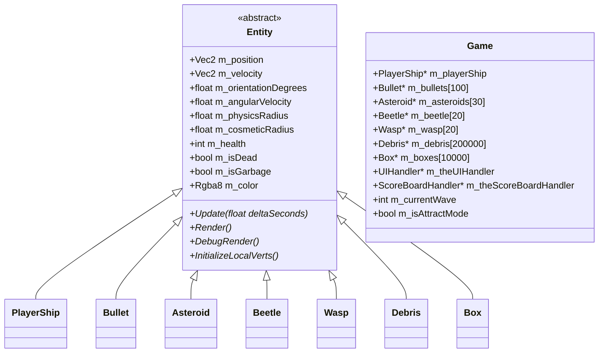

# Game Module - DaemonStarship

## Module Overview

The Game module contains all gameplay logic for DaemonStarship: entity management, player controls, enemy AI, collision detection, UI rendering, scoreboard persistence, and wave progression. It consists of 15 source file pairs (~4,000 LOC total) built as a C++20 project targeting DirectX 11 via the external Engine dependency.

## File Inventory

| File | Purpose |
|------|---------|
| `Main_Windows.cpp` | WinMain entry point, creates and runs `App` |
| `App.hpp/cpp` | Application lifecycle, frame loop, input handling, slow-motion |
| `Game.hpp/cpp` | Core game loop, entity pool management, wave spawning, state machine |
| `GameCommon.hpp/cpp` | All game constants, shared utilities, debug rendering helpers |
| `Entity.hpp/cpp` | Abstract base class for all game objects |
| `PlayerShip.hpp/cpp` | Player-controlled starship with thrust, rotation, shooting |
| `Bullet.hpp/cpp` | Player projectiles with lifetime and speed (`final`) |
| `Asteroid.hpp/cpp` | Asteroid enemies with random movement |
| `Beetle.hpp/cpp` | Beetle enemies that chase the player (`final`) |
| `Wasp.hpp/cpp` | Wasp enemies with acceleration-based pursuit (`final`) |
| `Debris.hpp/cpp` | Particle effects on entity hit/death (`final`) |
| `Box.hpp/cpp` | Box collectible entities (`final`) |
| `LevelData.hpp/cpp` | Wave definitions: enemy counts per wave (5 waves) |
| `UIHandler.hpp/cpp` | UI rendering: attract mode, HUD, name input, scoreboard |
| `ScoreBoardHandler.hpp/cpp` | Score file I/O to `Run/Data/Score/Scoreboard.txt` |
| `EngineBuildPreferences.hpp` | Engine feature toggles (debug render, audio, scripting) |

## Class Hierarchy



## Entity Pool Sizes

| Entity | Array Size | Constant |
|--------|-----------|----------|
| PlayerShip | 1 (single pointer) | — |
| Bullet | 100 | `MAX_BULLETS_NUM` |
| Asteroid | 30 | `MAX_ASTEROIDS_NUM` |
| Beetle | 20 | `MAX_BEETLE_NUM` |
| Wasp | 20 | `MAX_WASP_NUM` |
| Debris | 200,000 | `MAX_DEBRIS_NUM` |
| Box | 10,000 | `MAX_BOX_NUM` |

## Game Flow State Machine

```
Attract Mode → Name Input → Gameplay (Waves 1-5) → High Score Display → Attract Mode
```

1. **Attract Mode** (`m_isAttractMode = true`): Title screen, press start to begin
2. **Name Input** (`m_isPlayerNameInputMode = true`): Player enters name for scoreboard
3. **Gameplay**: 5 waves of increasing difficulty, player has 10 HP max
4. **High Score Display**: Scoreboard shown after game over, persisted to file

## Wave Data (LevelData.cpp)

| Wave | Beetles | Wasps | Asteroids |
|------|---------|-------|-----------|
| 1 | 2 | 1 | 3 |
| 2 | 3 | 2 | 4 |
| 3 | 5 | 3 | 5 |
| 4 | 4 | 4 | 6 |
| 5 | 6 | 5 | 7 |

## Key Constants (GameCommon.hpp)

### World
- `WORLD_SIZE_X = 200.0f`, `WORLD_SIZE_Y = 100.0f`
- `SCREEN_SIZE_X = 1600.0f`, `SCREEN_SIZE_Y = 800.0f`

### PlayerShip
- Acceleration: `30.0f`, Turn speed: `300.0f deg/s`
- Physics radius: `1.75f`, Cosmetic radius: `2.25f`
- Max health: `10`, Color: `Rgba8(102, 153, 204)` (light blue)

### Bullet
- Speed: `50.0f`, Lifetime: `2.0s`
- Physics radius: `0.5f`, Cosmetic radius: `2.0f`

### Asteroid
- Speed: `10.0f`, Starting count: `6`
- Physics radius: `1.6f`, Cosmetic radius: `2.0f`

### Beetle
- Physics radius: `1.5f`, Cosmetic radius: `2.25f`
- Color: `Rgba8(100, 160, 60)` (green)

### Wasp
- Acceleration: `10.0f`
- Physics radius: `1.73f`, Cosmetic radius: `2.0f`
- Color: `Rgba8(255, 255, 60)` (yellow)

## Architectural Patterns

- **Fixed-Array Pools**: All entity arrays are statically sized — no `new`/`delete` during gameplay
- **Dual-Radius Collision**: `m_physicsRadius` for gameplay hits, `m_cosmeticRadius` for visual bounds
- **Garbage Collection**: Entities set `m_isGarbage = true`, cleaned up at frame end
- **Local Vertex Arrays**: Each entity pre-computes transformed vertices for rendering
- **Camera Shake**: `m_shakeIntensity` / `m_shakeDuration` system on the world camera
- **GAME_SAFE_RELEASE<T>**: Template for RAII-style entity cleanup (null-check, delete, nullify)

## Engine Build Preferences

Configured in `EngineBuildPreferences.hpp`:
- `ENGINE_DEBUG_RENDER` — Enabled (debug visualization available)
- `ENGINE_DISABLE_AUDIO` — Commented out (audio enabled)
- `ENGINE_DISABLE_SCRIPT` — Not defined (V8 scripting enabled)
